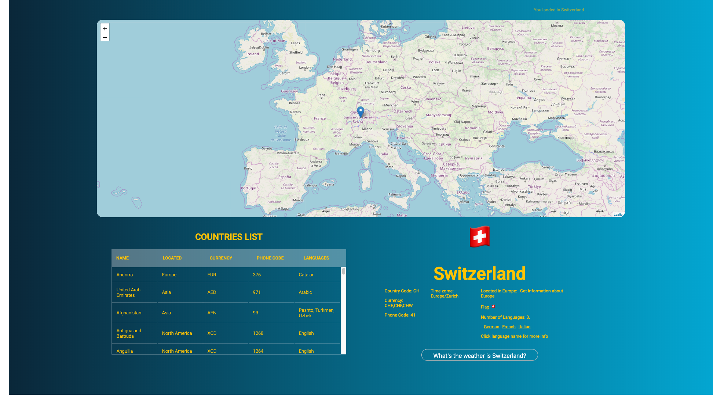

## React and Graphql

### Requirements
To run this project you need `docker` and `docker-compose`. If you do not have them installed on your machine please follow [this](./installingDockerAndDockerCompose.md) guide first on installing them.

### How to run the app

1. Clone the project `git clone`
2. Cd inside the project folder 
3. On the terminal run `docker-compose up --build`
4. After you see the message `Compiled successfully!`
5. Visit: [http://localhost:3000/](http://localhost:3000/)

#### Screenshots

